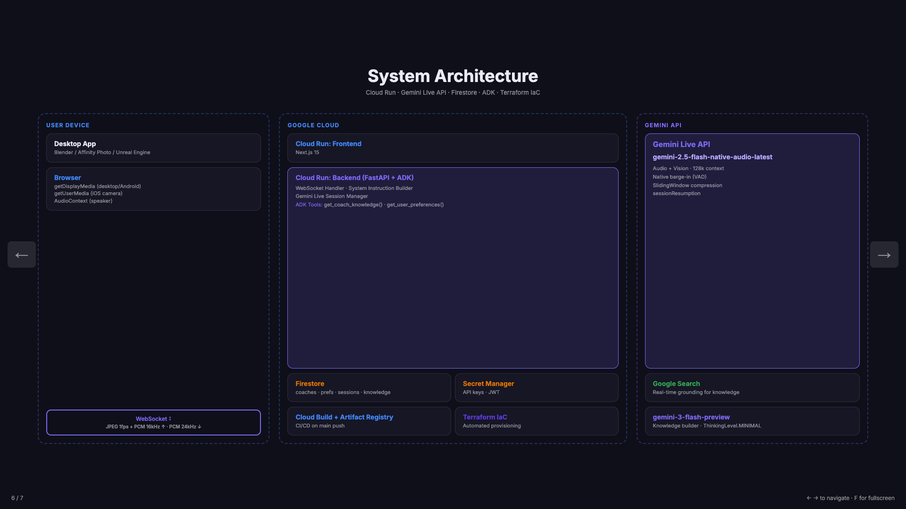

# Building ExpertLens: Real-time AI Coaching for Software You Control Directly

*Built for the #GeminiLiveAgentChallenge*

> **Disclaimer:** This post was created for the purposes of entering the Gemini Live Agent Challenge.

ExpertLens is a real-time voice and vision coaching agent for any software where the human must be the operator. Share your screen or point your camera, speak naturally, and get expert guidance — for Blender, Affinity Photo, Unreal Engine, a mobile game, or any app an AI cannot run on your behalf.

This post covers the core insight behind the project, how it's built on Gemini Live API, and four specific technical challenges that required non-obvious solutions.

---

## 1. The Human-Control Gap

When deciding what to build for this hackathon, I mapped the landscape of AI assistance by tool type:

**Browser-based apps** (Figma, Canva, Google Docs): Playwright and Selenium can automate these. LLM agents can literally control them by reading the DOM and clicking elements. AI coaching adds limited value when AI can just do the task.

**CLI and API-friendly tools** (git, ffmpeg, AWS CLI): LLMs can call these directly via tool use. An agent with shell access can run `git rebase -i` for you. No coaching needed.

**Everything else** — desktop GUI apps (Blender, Affinity Photo, Unreal Engine, DaVinci Resolve), native mobile apps, professional hardware interfaces, games: there is no programmatic interface accessible to an AI. The application is a closed binary. The mouse, keyboard, or touchscreen is the only way in — and only the human can use them. AI cannot automate anything. Coaching is the only viable form of AI assistance.

ExpertLens exists precisely in this gap. It watches your screen, listens to your voice, and advises you so you can command the application better. You stay in control. The AI makes you faster.

### Mobile support

ExpertLens works on mobile devices too. On iOS, `getDisplayMedia` is not available — but the rear camera works perfectly as a capture source. Point your phone at your screen or at a physical device, and ExpertLens can see exactly what you're looking at. On Android Chrome, full screen sharing works the same as desktop. The same agent, the same knowledge pipeline, the same live voice interaction — regardless of the device.

---

## 2. Why Not Just Use Gemini Live in AI Studio?

Gemini AI Studio has a built-in Live mode. You can share your screen, enable your microphone, and talk to Gemini about anything on screen. It works well. So why build ExpertLens?

Because general-purpose is not the same as expert. ExpertLens adds four concrete things:

**Curated knowledge that is current.** The seed sources include Blender 4.x-specific breaking changes: Auto Smooth was removed in 4.1 (replaced by the Smooth by Angle modifier), Bloom moved to the Compositor, keyframe shortcuts changed. General model training may not reflect these accurately. ExpertLens stuffs this knowledge directly into the system instruction at session start — zero additional latency.

**User preferences.** Every user is different. A shortcut-native power user needs different coaching than someone learning their first 3D software. ExpertLens supports interaction style (shortcuts-first vs. mouse-guided), tone (concise expert vs. calm mentor), response depth (short/medium/detailed), and proactivity (reactive/balanced/proactive). These are injected into every session's system instruction.

**Cross-session memory.** After each session, ExpertLens summarizes the coach's transcript using Gemini and stores it in Firestore. The next session loads the last three summaries and injects them as "## Previous Session Notes" into the system instruction. The coach picks up where you left off.

**Software-specific coaching personas.** The Blender coach is configured to lead every response with keyboard shortcuts, knows that Ctrl+2 applies Subdivision Surface Level 2, and treats the four Blender 4.x breaking changes as CRITICAL rules. A Blender session and an Affinity Photo session feel genuinely different.

---

## 3. Architecture

ExpertLens uses a two-layer grounding strategy designed for minimal latency:

**Primary: Context stuffing.** Curated knowledge is loaded into the system instruction at session start. Every coach has a dedicated prompt template (`agent/prompts/coaches/<software>.py`) with up to 50–70 pages of shortcuts, workflows, and common errors. Zero latency — no tool call needed for the most common questions.

**Fallback: Firestore tool.** The `get_coach_knowledge(topic)` ADK tool hits Firestore for deeper queries not covered by context. Latency: ~100–200ms.



The backend is FastAPI + ADK running on Cloud Run. The browser streams JPEG frames (~1fps, resized to 768×768) and PCM 16kHz audio over WebSocket. The Gemini Live session relays responses as PCM 24kHz audio back to the browser. The knowledge builder uses `gemini-3-flash-preview` with Google Search grounding to generate and keep coach knowledge current.

**Deployment** is fully automated: every push to `main` triggers a Cloud Build pipeline that builds both Docker images, pushes to Artifact Registry, deploys to Cloud Run, and persists CORS configuration — no manual steps.

---

## 4. Four Technical Challenges

### Challenge 1: The 2-Minute Image Session Limit

**Problem:** Any image frame sent to Gemini Live API triggers "audio+video" mode, which has a 2-minute hard limit. A screen-sharing coaching session obviously needs to run longer than 2 minutes.

**Solution:** `contextWindowCompression` with `SlidingWindow`. Setting this in the Live session config tells Gemini to automatically compress older context when approaching the window limit. The session continues indefinitely. Without this, every screen-sharing session terminates after 2 minutes — a silent failure with no obvious error message.

```python
config = LiveConnectConfig(
    context_window_compression=ContextWindowCompressionConfig(
        sliding_window=SlidingWindow(),
        trigger_tokens=25600,
    ),
    ...
)
```

### Challenge 2: The ~10-Minute WebSocket Timeout

**Problem:** Gemini Live API WebSocket connections terminate after approximately 10 minutes. Cloud Run also has connection timeouts. A coaching session for learning a complex tool easily exceeds 10 minutes.

**Solution:** `sessionResumption`. When the server receives a `GoAway` signal, it stores the session handle and reconnects within 2 minutes (the handle's validity window). The client sees a brief "Reconnecting..." status and the session picks up with full context.

```python
config = LiveConnectConfig(
    session_resumption=SessionResumptionConfig(handle=saved_handle),
    ...
)
```

The handle must be stored server-side and refreshed on every `new_handle` event — this needs to be designed in from the start, not added later.

### Challenge 3: Zero-Latency Grounding

**Problem:** Grounding via RAG (vector search) adds 200–500ms per query in a live voice conversation. That latency is perceptible and breaks the conversational feel.

**Solution:** Context stuffing. All curated knowledge for a coach is pre-loaded into the system instruction at session start. The `build_system_instruction_from_firestore` function in `agent/prompts/base.py` assembles the full instruction including coach knowledge, user preferences, and session history before the WebSocket connection opens. The Firestore `get_coach_knowledge` tool exists as a fallback for deep queries, but most questions are answered from context.

Trade-off: system instruction size is bounded by the 128k context window. In practice, 50–70 pages of curated content fits well within this limit.

### Challenge 4: Non-Blocking Tool Calls

**Problem:** ADK tool calls by default pause the audio stream while executing. If `get_coach_knowledge` takes 150ms, the coach goes silent mid-sentence. This is jarring in a live voice session.

**Solution:** `NON_BLOCKING` tool call mode with `scheduling='WHEN_IDLE'`. Tools execute between agent turns rather than interrupting them. The agent continues speaking; the tool result is incorporated into the next turn.

```python
@FunctionTool
def get_coach_knowledge(topic: str) -> dict:
    ...

# In agent config:
tool_config = ToolConfig(
    function_calling_config=FunctionCallingConfig(
        mode=FunctionCallingConfigMode.NON_BLOCKING,
        scheduling=SchedulingMode.WHEN_IDLE,
    )
)
```

---

## 5. Cross-Session Memory: How It Works

The memory pipeline runs entirely in the background and adds less than 1 second to session start latency.

**Accumulation:** During a session, `handler.py` appends every coach turn to `_coach_transcript` — a list capped at 30 entries × 500 characters each (~15KB max). Only coach turns are kept; user audio is not transcribed.

**Summarization:** On session cleanup, `summarize.py` calls `gemini-2.0-flash` with `response_mime_type="application/json"` and a typed schema. It returns a structured `(summary, topics)` object. The call has a 5-second timeout — if it fails, the session still ends cleanly.

**Storage:** The summary is written to Firestore under the session document, keyed by `user_id` (an anonymous UUID per browser connection) and `coach_id`.

**Injection:** At the start of the next session, `base.py`'s `build_system_instruction_from_firestore` queries the last 3 session summaries with a strict 1-second timeout. If Firestore is slow, the session starts without history — acceptable graceful degradation. The summaries are injected as "## Previous Session Notes" in the system instruction, before the knowledge reference section.

The result: the coach opens each session with context about what the user was working on, without any user effort.

---

## 6. Authentication and Privacy

ExpertLens uses JWT-based authentication. Users log in with credentials, receive a signed token, and all subsequent API requests are authenticated via Bearer token. Each browser connection is assigned an anonymous UUID (`user_id`), which scopes session history and preferences to that user.

**What's stored:** Coach profiles, user preferences, and session summaries (generated text) are persisted in Firestore. Raw audio and video frames are never stored — they stream through the WebSocket to Gemini Live API and are discarded after processing. Session summaries contain only the coach's responses, not user audio transcriptions.

**Coach ownership:** Coaches created by a user are private to that user's account. The API enforces ownership checks on all coach CRUD operations.

---

## 7. What's Next

Two features are on the roadmap:

**On-screen annotation.** The coach could highlight UI elements in the user's screen share — "click this button" with a visual overlay. This requires a second WebSocket channel for screen coordinates and a browser-side overlay component.

**Coach sharing.** Users could publish custom coaches to a directory, so a DaVinci Resolve expert coach built by one user benefits everyone.

---

ExpertLens is live at: https://expertlens-frontend-pk4kcjevqa-uc.a.run.app

Source: https://github.com/TheIllusionOfLife/ExpertLens

*#GeminiLiveAgentChallenge*
